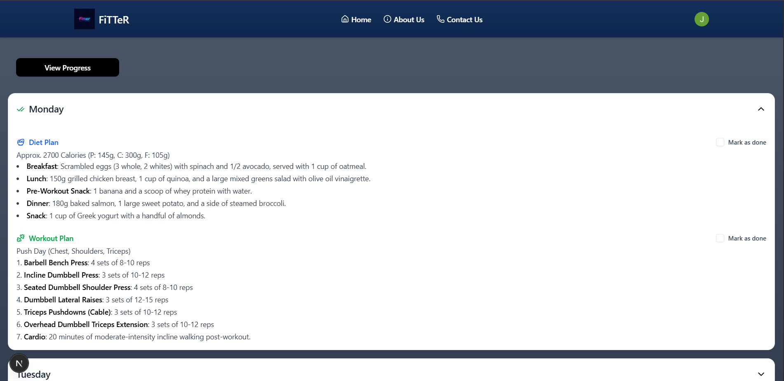
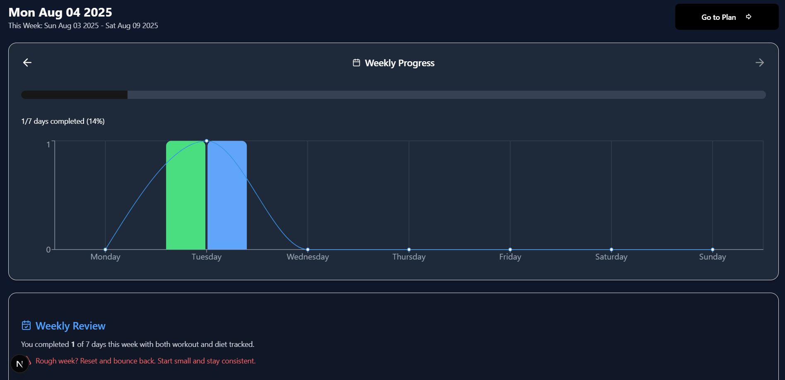
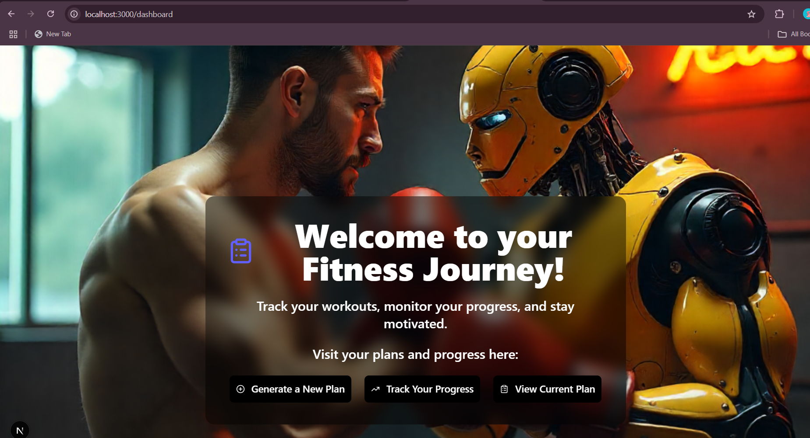

# 🏋️‍♂️ Fitter – Personalized Fitness & Diet Planner

A full-stack fitness planning application that generates **personalized weekly workout and diet plans** based on user input. Users can **track daily progress**, **mark tasks as done**, and **view historical charts** — all with secure authentication and real-time database integration.

---

## 📸 Screenshots

### Plans


### Progress Tracker  


### Planner
![Planner] (./screenshots/Planner.png)

### Dashboard  



---

## ✨ Features

- 🔐 **Clerk Authentication** – Secure sign-up & login flows.
- 🧠 **AI-Powered Plan Generator** – Weekly plans created via the Gemini API.
- ✅ **Daily Progress Tracking** – Interactive checkboxes to monitor completion.
- 📊 **Animated Progress Charts** – Visualize weekly and monthly progress.
- 💾 **Data Persistence** – Supabase and Prisma for a reliable backend.
- ⚡ **Responsive UI** – Clean interface built with Shadcn-UI, TailwindCSS & Lucide Icons.
- 🔁 **Automated Resets** – Progress resets daily, and plans are archived weekly.

---

## 🛠 Tech Stack

| Category         | Technology                         |
|------------------|-------------------------------------|
| **Framework**    | Next.js (App Router, TypeScript)    |
| **Styling**      | Shadcn-UI, TailwindCSS, Lucide Icons|
| **Auth**         | Clerk                               |
| **Database**     | Supabase (PostgreSQL)               |
| **ORM**          | Prisma                              |
| **AI API**       | Gemini (Google AI API)              |
| **Hosting**      | Vercel                              |

---

## 📁 Folder Structure

```

src/
├── app/              → App Router pages and API routes
│   ├── (auth)/       → Clerk login/signup routes
│   ├── api/          → API endpoints (plan, progress)
│   └── (dashboard)/  → Main UI pages (plan, progress, tracker)
├── components/       → Shared UI components
├── lib/              → Prisma client, utilities
└── styles/           → Global CSS

prisma/
├── schema.prisma     → Prisma schema
└── migrations/       → DB migration history

```

---
## ⚙️ Getting Started


### 1. Clone the Repository

```bash
git clone https://github.com/YOUR_USERNAME/YOUR_REPO_NAME.git
cd YOUR_REPO_NAME
```

### 2. Installing Dependencies

```bash
npm install
# or
pnpm install
```

### 3. Set Up Environment Variables

Create a ```.env.local ``` file in the root of your project:

```bash
DATABASE_URL=your_supabase_database_url
CLERK_SECRET_KEY=your_clerk_secret_key
NEXT_PUBLIC_CLERK_PUBLISHABLE_KEY=your_clerk_publishable_key
GEMINI_API_KEY=your_gemini_api_key
```

### 4. Set Up Prisma

```bash
npx prisma generate
npx prisma migrate dev --name init
```
### 5. Run 
```bash
npm run dev
```

---

## 🧪 Environment Variables Reference

| Variable                             | Description                                 |
|--------------------------------------|---------------------------------------------|
| `DATABASE_URL`                       | Your Supabase DB URL (PostgreSQL)           |
| `CLERK_SECRET_KEY`                   | Clerk backend secret key                    |
| `NEXT_PUBLIC_CLERK_PUBLISHABLE_KEY` | Clerk frontend publishable key              |
| `GEMINI_API_KEY`                     | Google Gemini API key for AI plan generation |

---

## 📊 Database Schema (Prisma)

Example schema for daily progress tracking:

```prisma
model DailyProgress {
  id          String   @id @default(cuid())
  userId      String
  date        DateTime @unique
  day         String
  workoutDone Boolean  @default(false)
  dietDone    Boolean  @default(false)
  createdAt   DateTime @default(now())
}
```
> Prisma and Supabase are integrated using the `@prisma/client` and Supabase’s connection string.

---

## 💡 Future Enhancements

- 🔔 Push notifications for daily reminders  
- 🏆 Gamified achievements and rewards  
- ⏱ Timer-based workouts  
- 🧍‍♀️ Social sharing of fitness plans  
- 📱 Convert to a Progressive Web App (PWA)  

---

## 🧑‍💻 Author

**Jagrat Phugat**  
📧 [Connect on LinkedIn](https://www.linkedin.com/in/jagrat-phugat-916aa4253/)  
🌐 [GitHub Profile](https://github.com/jagrat-phugat)

---


